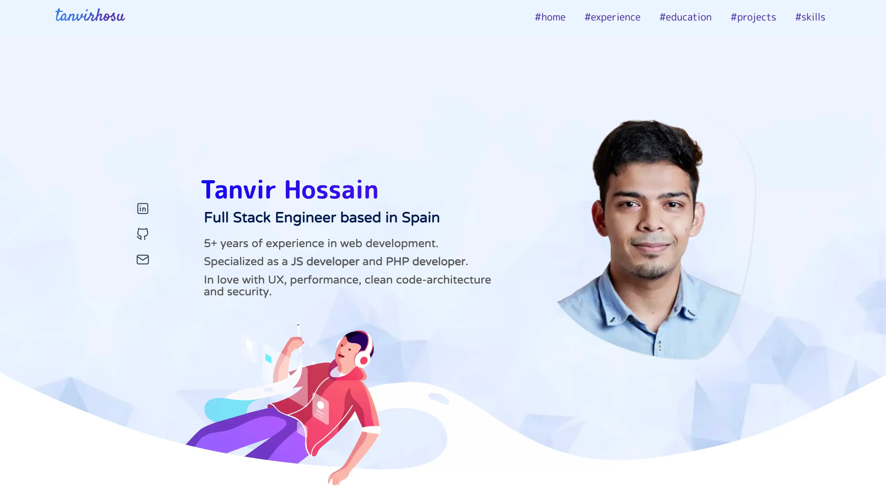

<a name="readme-top"/>

<div align="center">
  <a href="https://github.com/tanvirhosu/portfolio" target="_blank">
    
  </a>

  <h3 align="center">Tanvir Hossain's Portfolio</h3>

  <p align="center">
    A portafolio that represents a professional career of author.
    <br />
    <a href="https://tanvirhosu.netlify.app" target="_blank"><strong>Explore »</strong></a>
    <br />
    <p>
      <a href="https://www.linkedin.com/in/tanvirhosu">
        
      </a>
      <a href="mailto:tanvirhosu@gmail.com">
        
      </a>
      <a href="https://www.x.com/htanvir17">
        
      </a>
      <a href="https://www.instagram.com/tanvirhosu/">
        
      </a>
    </p>
  </p>
</div>

---

## 🎯 About project

<div align="center">
  
</div>

The main idea of this project is to summarize the author's professional career in tech industry. This portfolio will help to know precisely the experiences, abilities, skills, etc. from the author.

The application decisions are as follows:

- [Why Astro?](docs/0-starter-kit.md)
- [Roadmap](docs/1-roadmap.md)

<p align="right">(<a href="#readme-top">Go to top</a>)</p>

## 👨🏻‍💻 Getting started

To run this project locally, follow these steps:

### 📋 Prerequisites

- Check Git version
  ```bash
  git --version
  ```

  - If not installed, [download from Git](https://git-scm.com) (v2.50 or higher)
- Check Node.js version
  ```bash
  node -v
  ```

  - If not installed, [download from Node.js](https://nodejs.org/en/download) (v24 or higher). [Recommendation: use NVM with NPM]

### 📦 Installation

- Clone repository
  ```bash
  git clone https://github.com/tanvirhosu/portfolio.git
  cd portfolio
  ```
- Install project dependencies
  ```bash
  npm install
  ```
- Start local development server (default port: 4321)
  ```bash
  npm run dev
  ```

### 📦 Build for production

- Generate static site to `./dist` (production output)
  ```bash
  npm run build
  ```
- Preview production build locally
  ```bash
  npm run preview
  ```
- Deploy to static host service (e.g., Netlify): no setup required, will be deployed automatically from GitHub repo. 

<p align="right">(<a href="#readme-top">Go to top</a>)</p>

## 📝 License

Distributed under the MIT License. See [LICENSE](./LICENSE) for more information.

<p align="right">(<a href="#readme-top">Go to top</a>)</p>
